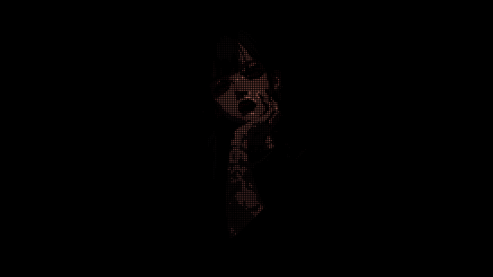

# pixa

Convert any image into a dot-style wallpaper.




## Install

```bash
curl -fsSL https://raw.githubusercontent.com/SamuzDev/pixa/main/install.sh | bash
```

Or with pip:

```bash
pip install .
```

Or run directly:

```bash
python pixa.py input.jpg
```

## Usage

```bash
# White dots on black (default), auto 1920x1080
pixa image.jpg

# Colored dots, background removed
pixa image.jpg --mode color

# Full image as dots, original background preserved
pixa image.jpg --mode full

# Custom resolution
pixa image.jpg -w 2560 -ht 1440

# Custom output path
pixa image.jpg -o my_wallpaper.jpg
```

## Modes

| Mode | Description |
|------|-------------|
| `white` | Character only, white dots, black background |
| `color` | Character only, colored dots, black background |
| `full` | Whole image as dots, original background preserved |

## Options

| Option | Default | Description |
|--------|---------|-------------|
| `-o, --output` | `output.<ext>` | Output path (preserves input format) |
| `-w, --width` | auto | Output width in px |
| `-ht, --height` | auto | Output height in px |
| `-d, --dot-size` | `7` | Spacing between dots |
| `-r, --radius` | `3.2` | Max dot radius |
| `-th, --threshold` | `25` | Min brightness to render |
| `--mode` | `white` | `full` / `color` / `white` |
| `--bg` | auto | Background hex color |
| `--text-color` | `#ffffff` | Dot color (white mode) |

## License

MIT
